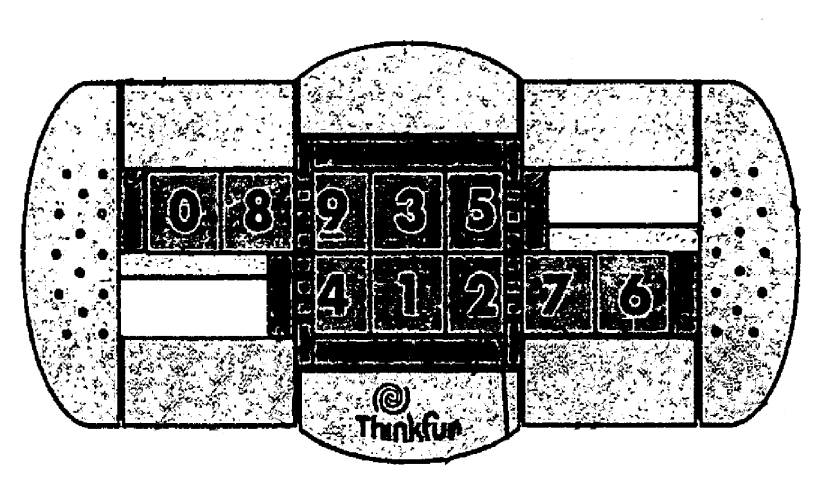

# Flip-Side Puzzle

Flip-Side is a recent puzzle by Thinkfun. It consists of a frame containing 10 numbered blocks in two rows of five. In the centre of the frame is a turntable that holds 3 blocks from each row. When turned, the three blocks in the top row swap with the three blocks directly beneath them. Each row can slide left or right, so you can choose which three adjacent blocks in a row are flipped to the other row. The blocks are numbered, and the aim is of course to arrange them in numerical order after they have been mixed, i.e. 01234 on the top row, 56789 on the bottom row.





Flip-Side was invented by Ferdinand Lammertink, who also invented Topspin, Backspin, and Triple Cross. The puzzle's patent, US 2006/279041, was published 14 December 2006.


## Game Representatión

We will represent the game-state as a bidimensional matrix where the empty spaces will be represented with the value -1. To implement this we use a numpy array.

For example, the winning state will be represented as:

```python
np.array([[-1, 0, 1, 2, 3, 4, -1], 
          [-1, 5, 6, 7, 8, 9, -1]])
```


To make a game move we will use advanced numpy indexing. In the example shown below the movement of the top row to the right is shown.

```python

i = np.array([[0, 0, 0, 0, 0, 0, 0],
                [1, 1, 1, 1, 1, 1, 1]])
j = np.array([[6, 0, 1, 2, 3, 4, 5],
                [0, 1, 2, 3, 4, 5, 6]])
new_game_state = game_state[(i, j)]

```

To see the other movement options you can see [here](src/game_moves.py)